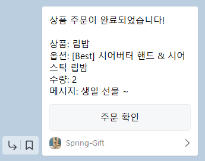

# 📝 소개

- - -
카카오테크 캠퍼스 백엔드 step2 과정으로 카카오톡의 선물하기 기능을 클론 코딩하는 것을 목적으로 한다.

### [Step1 ReadMe](step1.md)

### [Step2 ReadMe](step2.md)

---

## 카카오 로그인 구현
---

- 카카오 로그인을 통해 인가 코드를 받고, 인가 코드를 통해서 토큰을 받은 후 향후에 카카오 API 사용을 하기 위한 목적으로 구현했습니다!

### 주요 변경 사항

- 기존의 auth 로그인 방식 제거(카카오 로그인 도입으로 기존의 로그인 로직을 삭제합니다.)
- 카카오 로그인 구현
    - [x] 카카오 develpers 카카오 로그인 활성화 및 권한 설정
    - [x] 인증 코드를 통해서 토큰 내려받기
    - [x] 토큰을 통해서 사용자 정보 조회
    - [x] 회원 가입 및 로그인 로직 구현
- 카카오 로그인 E2E 테스트 작성

### 전체적인 흐름

1. 클라이언트가 `GET /api/auth/kakao/login` 요청
2. 백엔드에서 카카오 로그인 페이지 URL로 302 리다이렉트 응답
3. 사용자가 카카오 로그인 및 동의 절차를 완료
4. 카카오 서버가 설정된 리다이렉트 URL(`GET /api/auth/kakao/callback?code=...`)로 인가 코드(code) 전달
5. 백엔드가 전달받은 인가 코드로 카카오 토큰 발급 API 호출 (POST `https://kauth.kakao.com/oauth/token`)
6. 발급받은 액세스 토큰을 이용해 카카오 사용자 정보 API 호출 (GET `https://kapi.kakao.com/v2/user/me`)
7. 조회한 사용자 정보를 바탕으로 회원가입 또는 로그인 처리, 이후 JWT 토큰 발급 및 응답

#### 주의 사항

client-id와 client-secret은 properties에 따로 올리지 않았습니다!

---

## 카카오 주문하기 구현
---

### 핵심 기능 구현

1. 카카오 주문하기 시 상품 옵션의 수량 차감
2. 카카오 주문하기 시 해당 상품이 위시 리스트에 있으면 위시리스트에서 삭제
3. 카카오 주문하기 시 주문 상품, 수량, 메세지를 담아서 카카오톡 메세지 전송

---

### 주요 기능 구현 및 리팩토링

### 주요 기능

#### 1. 카카오 서버 `accessToken`, `refreshToken` DB 저장 및 재발급 로직 구현

- 카카오 주문하기 API 호출 시 필요한 `accessToken`을 DB에 저장하여 관리합니다.
- `@CurrentUser` 리졸버를 통해 토큰을 컨트롤러에서 쉽게 사용할 수 있도록 구현하였습니다.
- 토큰 만료 시 DB에 저장된 `refreshToken`을 통해 자동 재발급 처리하도록 로직을 구현하였습니다.

#### 2. 기존 JSON 응답 → 쿠키 방식으로 변경

- 기존에는 토큰을 JSON으로 반환했으나 쿠키를 반환하는 방식으로 수정합니다.

---

### 리팩토링

#### 1. 상품 수정 로직 개선

- 옵션 전체 교체 방식에서 → 옵션 개별 수정 방식으로 변경했습니다.

#### 2. 도메인 VO 생성 및 검증 로직 분리

- VO 생성으로 검증 로직을 VO 내부로 이동시켜 책임을 분리해보았습니다.

#### 3. 카카오 API 클라이언트 모듈화

- `KaKaoMessageClient`, `KaKaoTokenClient` 등을 별도 빈으로 분리하여 관리하도록 했습니다.

#### 4. 패키지 구조 개선

- 도메인 중심 패키지 구조로 패키지 구조를 변경하였습니다.

#### 5. 예외 처리 개선

- `CustomException`에 `HttpStatus` 기반 예외 코드 추가하였습니다.
- 이에 따라 전역 예외 핸들러에도 수정 사항이 있습니다.

---

### 카카오 주문하기 API

| URL           | 메서드  | 기능    | 설명                                                                   |
|---------------|------|-------|----------------------------------------------------------------------|
| `/api/orders` | POST | 주문 하기 | 상품 옵션의 수량을 차감하고 카카오톡 메세지를 보낸다.<br/> 추가적으로 위시리스트에 해당 상품이 존재할 경우 삭제한다. |

**Request**

```json
{
  "optionId": 1,
  "quantity": 1,
  "message": "생일 선물 ~"
}
```

**Response**

```json
{
  "status": 201,
  "message": "생성 성공",
  "data": {
    "id": 1,
    "productId": 1,
    "optionId": 1,
    "quantity": 1,
    "message": "생일 선물 ~"
  }
}
```

#### 메세지 포맷 예시

